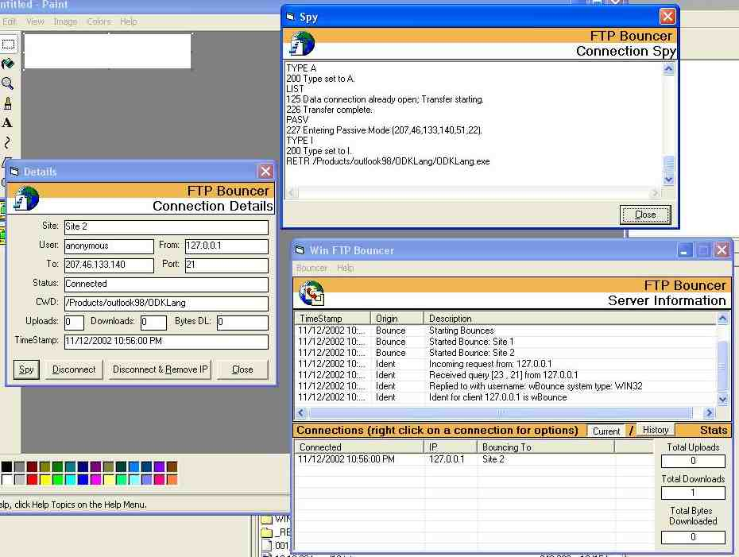



## FTP Bouncer, Supports many bounces running at once\.

### Description

This is a complete ftp bouncer application for windows. It allows you to "bounce" connections to ftp sites through this software. And it has a built in telnet server that gives you complete remote administration and contorl. It is about 90% complete (still some things I should do to improve the identd code). Its got a good gui, allows you to spy on connections. It also allows you to disable downloads, uploads and site commands. It shows you all kinds of statistics on each connection when you are spying. Everyone ftping through a bouncer needs to remember that they have to set their ftp client to PASV (passive) mode for it to work.

This uses some menu code I got from another application on PSC. I do not know the origial author (the person I got it from didnt give credit.) If anyone knows the authors name, tell me so I can give proper credit :)

To spy on connections, once one is in the listview just right click on it and a menu will appear.

*UPDATED* fixed a couple small bugs, made the disconnect button on the details window work.
 
### More Info
 

             |
---                |---
**Submitted On**   |2002-11-13 04:40:48
**By**             |[Gregg Housh](https://github.com/Planet-Source-Code/PSCIndex/blob/master/ByAuthor/gregg-housh.md)
**Level**          |Intermediate
**User Rating**    |3.7 (11 globes from 3 users)
**Compatibility**  |VB 6\.0
**Category**       |[Complete Applications](https://github.com/Planet-Source-Code/PSCIndex/blob/master/ByCategory/complete-applications__1-27.md)
**World**          |[Visual Basic](https://github.com/Planet-Source-Code/PSCIndex/blob/master/ByWorld/visual-basic.md)
**Archive File**   |[FTP\_Bounce14969711142002\.zip](https://github.com/Planet-Source-Code/gregg-housh-ftp-bouncer-supports-many-bounces-running-at-once__1-40675/archive/master.zip)

